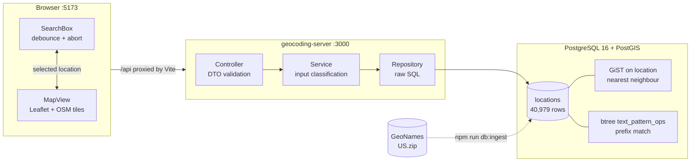
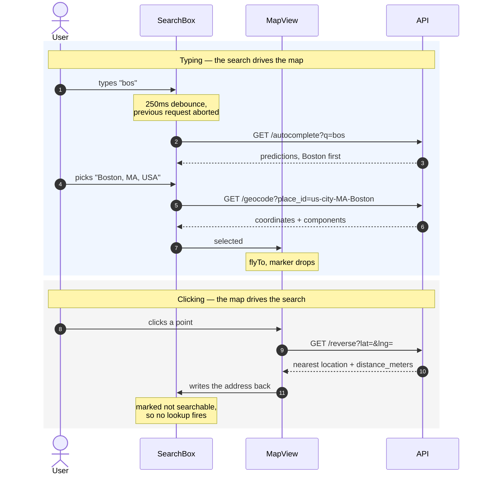

# Geocoding

A US ZIP-code geocoding service: forward lookup with autocomplete, and reverse
geocoding from a pair of coordinates.

| Layer    | Choice                                         |
| -------- | ---------------------------------------------- |
| Backend  | NestJS on Fastify, TypeScript                  |
| Database | PostgreSQL 16 + PostGIS                        |
| Frontend | React 19 + Vite, Leaflet with OpenStreetMap tiles |
| Data     | [GeoNames](https://download.geonames.org/export/zip/) US postal codes — 40,979 places |




## Running it

Requires Node 20+ and Docker.

```bash
npm install
cp .env.example .env
docker compose up -d      # Postgres + PostGIS
npm run db:reset          # apply migrations, then ingest the dataset
npm run dev               # api on :3000, web on :5173
```

Open http://localhost:5173. The first `db:reset` downloads ~600 KB from
GeoNames and takes a few seconds; the archive is cached in `data/` afterwards.

`db:reset` can be run straight after `docker compose up -d` — the scripts wait
for Postgres to accept a query rather than trusting the container to be ready.

### Trying the API directly

```bash
curl 'localhost:3000/api/v1/autocomplete?q=bos'
curl 'localhost:3000/api/v1/geocode?place_id=us-city-MA-Boston'
curl 'localhost:3000/api/v1/reverse?lat=42.31&lng=-71.11'
curl 'localhost:3000/api/v1/reverse?lat=0&lng=0'      # ZERO_RESULTS
```

### Tests

```bash
npm test               # unit — server and web, no dependencies
npm run test:integration  # API against Postgres; UI against a faked network
npm run test:e2e       # Chromium against the running stack
npm run test:all       # all of the above
```

| Suite | Count | Runs against |
| ----- | ----- | ------------ |
| Server unit | 31 | nothing |
| Web component | 10 | jsdom, API client mocked |
| UI integration | 22 | real client and fetch, network faked with MSW |
| API integration | 18 | real Postgres, app in-process |
| Browser end-to-end | 9 | Chromium, API and Postgres, nothing faked |

CI runs all five on every pull request, plus a typecheck, a production-only
`npm audit`, and `db:verify` — which asserts the schema, the indexes, and that
both query shapes still reach an index.

## The API

Three read endpoints under `/api/v1`, modelled on the Google Geocoding API: a
status enum alongside a results array, so a caller can tell "no match" from
"bad request" without inspecting the HTTP status alone.

```
GET /autocomplete?q=&limit=    predictions — id and display string only
GET /geocode?q=|place_id=      full result with components and coordinates
GET /reverse?lat=&lng=         nearest location plus distance_meters
GET /health
```

`ZERO_RESULTS` is a **200, not a 404**. Finding nothing is an answer, not an
error; a 404 would mean the endpoint does not exist.

One search field handles every input shape, routed at the index built for it:

| Input | Treated as |
| ----- | ---------- |
| `bos` | city prefix |
| `021` | ZIP prefix |
| `02108` | exact ZIP |
| `Boston, MA` | city prefix, constrained to a state |

Text after a comma that is not a real state code degrades to a plain city
search rather than returning a 400 — the user is mid-typing.

### How the two interactions connect



Both halves write to the same `selected` state, which is why either can drive
the other. Text the app writes back is flagged as not searchable — otherwise
filling the field after a map click would fire an autocomplete for an address
that was just resolved.

## Technical decisions

### PostgreSQL with PostGIS

The service has two query shapes, and they want different indexes:

- **Autocomplete** needs prefix matching — `WHERE lower(city) LIKE 'bos%'`, on
  every keystroke.
- **Reverse geocoding** needs nearest-neighbour on a point, ordered by real
  distance.

Postgres serves both from one table, so there is no second datastore to keep in
sync. A GiST index on a `GEOGRAPHY(POINT, 4326)` column lets the `<->` operator
walk the tree in distance order and stop at `LIMIT`, and `GEOGRAPHY` over
`GEOMETRY` gives metre-accurate distances on a spheroid with no projection
maths in application code.

```sql
CREATE TABLE locations (
  id         BIGSERIAL PRIMARY KEY,
  zip        TEXT NOT NULL UNIQUE,
  city       TEXT NOT NULL,
  state_code CHAR(2) NOT NULL,
  state_name TEXT NOT NULL,
  location   GEOGRAPHY(POINT, 4326) NOT NULL,
  updated_at TIMESTAMPTZ NOT NULL DEFAULT now()
);

CREATE INDEX locations_location_idx     ON locations USING GIST (location);
CREATE INDEX locations_city_prefix_idx  ON locations (lower(city) text_pattern_ops);
CREATE INDEX locations_zip_prefix_idx   ON locations (zip text_pattern_ops);
```

The prefix indexes use `text_pattern_ops`. Without that opclass the default
btree will not serve a `LIKE 'bos%'` query in a non-C locale, and the planner
silently falls back to a sequential scan.

Measured on the full dataset:

| Query | Cold | Warm |
| ----- | ---- | ---- |
| Reverse geocode (KNN) | 89 ms | **0.19–0.40 ms** |
| Autocomplete (prefix) | 6.9 ms | ~0.5 ms |

The cold figure is a one-off cost to fault index pages into `shared_buffers`.

Worth being honest about: at 41,000 rows a linear scan would also work. The
index choices are what this service looks like at 40 million rows, not what the
current data forces. Mongo could serve the geospatial half with `2dsphere` but
has a weaker prefix story; Elasticsearch would serve the text half well but
means running and synchronising a second system for 41,000 rows.

### Raw SQL rather than an ORM

These queries are index-sensitive. Hiding `<->` behind a query builder makes it
easy to lose the plan without noticing, and losing it costs nothing visible —
every test still passes, the endpoint just gets slower. All SQL lives in
`geocoding.repository.ts`; `db:verify` asserts the plans in CI.

### Autocomplete ranks cities by ZIP count

The dataset carries no population or prominence column. Without a ranking
signal, typing `bos` returned Boss MO, Bosler WY and Bosque NM while Boston sat
below the fold.

A city's ZIP count stands in for its size — Boston spans 36, Boss spans 1. Text
queries also collapse to one row per city rather than listing all 36 Bostons,
with coordinates taken from the centroid of its ZIPs. Numeric queries still
return individual ZIPs, since that is what was asked for.

### Reverse geocoding is bounded at 100 km

Nearest-centroid always returns something. Clicking the mid-Atlantic resolved
confidently to Eastport, ME — 8,219 km away. Past the bound the answer is
`ZERO_RESULTS`, which is what a real geocoder reports there. The bound is
generous enough for sparse rural ZIPs; a click in central Nevada still resolves
at 7 km.

Every reverse result carries `distance_meters`, so a caller can judge the match
rather than trusting it.

### NestJS on Fastify, Vite without Next.js

Nest gives structure and declarative validation: `class-validator` DTOs with
the global pipe in whitelist mode reject unknown parameters, out-of-range
coordinates and oversized limits before anything reaches SQL. The Fastify
adapter is a one-line swap over the Express default.

The UI is a client-side map with no SSR or SEO requirement, and the API is a
separate service, so Next.js would add build complexity for no benefit —
Leaflet is client-only regardless. Vite proxies `/api` in development, which
keeps the browser on a single origin so CORS never applies.

### Ingestion is repeatable, not one-shot

`db:ingest` streams the export line by line, validates each row, and upserts in
batches of 1,000 keyed on `zip`. Running it twice leaves the row count
unchanged, so the same script works unmodified as a scheduled refresh.

Skipped rows are reported by reason rather than counted. All 511 US skips are
APO/FPO military mail codes, which carry no state code because the AA/AE/AP
designator sits in the place name — routing identifiers rather than places, so
they are excluded deliberately.

```
41,490 parsed · 40,979 upserted · 511 skipped · 1.1s
  skipped 511 — no_state_code
```

Migrations are separate from data loading: `db:migrate` changes structure,
`db:ingest` changes rows, and neither calls the other.

## Known limitations

- **ZIP-level only.** The dataset has no street addresses, so `123 Main St`
  cannot be resolved. "Address" here means city, state or ZIP. Street-level
  geocoding needs a different source — TIGER/Line or OpenAddresses.
- **Reverse geocoding is nearest-centroid, not polygon containment.** This
  dataset holds one point per ZIP, so "which ZIP contains this point" is
  approximated by "which ZIP centre is closest". Doing it properly means
  ingesting ZCTA boundary shapefiles and using `ST_Contains`.
- **US only**, because the ingest reads the US export. Other countries use the
  same GeoNames format, so this is a matter of ingesting more files and adding
  a country column.
- **No authentication, rate limiting or caching.** All three would matter
  before this served real traffic.
- **Exact prefix matching, so no typo tolerance.** `bostn` returns nothing.

## With more time

- **Trigram fuzzy matching** with `pg_trgm`, so `bostn` still finds Boston.
  The extension coexists with the current indexes; the ranking is the part that
  needs care.
- **ZCTA boundary polygons**, turning reverse geocoding from nearest-centroid
  into actual containment.
- **A shared workspace package for the API contract**, so the frontend types
  are generated from the backend DTOs instead of hand-mirrored in
  `web/src/api/types.ts`. Skipped here because it adds build ordering and
  project references for three interfaces.
- **Caching.** Autocomplete prefixes are extremely repetitive and would sit
  well behind Redis, or behind HTTP cache headers for a CDN.
- **Pagination** on autocomplete. It is capped at 20 with no way to page.
- **Load testing** with k6 to find where the connection pool becomes the
  bottleneck, and to confirm the index behaviour holds under concurrency
  rather than in isolation.
- **A readiness endpoint** separate from `/health`. `/health` is deliberately
  dependency-free — a liveness probe that checks Postgres turns a database
  blip into a restart storm — so the database check belongs in a `/ready` that
  pulls an instance out of the load balancer without killing it.
- **Structured logging with a request id**, and OpenTelemetry spans around the
  database calls.

## Repository layout

```
geocoding/
├── docker-compose.yml         Postgres 16 + PostGIS
├── data/sample.txt            12-row fixture — 9 places plus 3 APO/FPO rows
├── server/
│   ├── migrations/            forward-only SQL, tracked in schema_migrations
│   ├── scripts/               migrate, ingest, verify
│   └── src/geocoding/         controller → service → repository
└── web/
    ├── e2e/                   Playwright
    └── src/
        ├── api/               client and response types
        └── components/        SearchBox, MapView
```

Delivered across three pull requests — data layer, API, UI — each with its own
description and a green pipeline.
